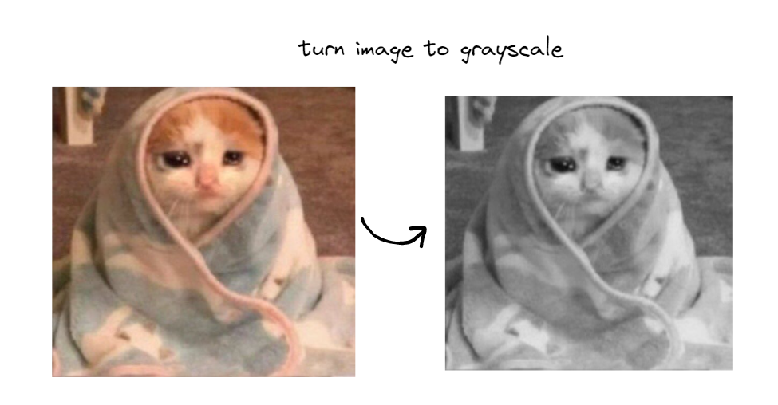
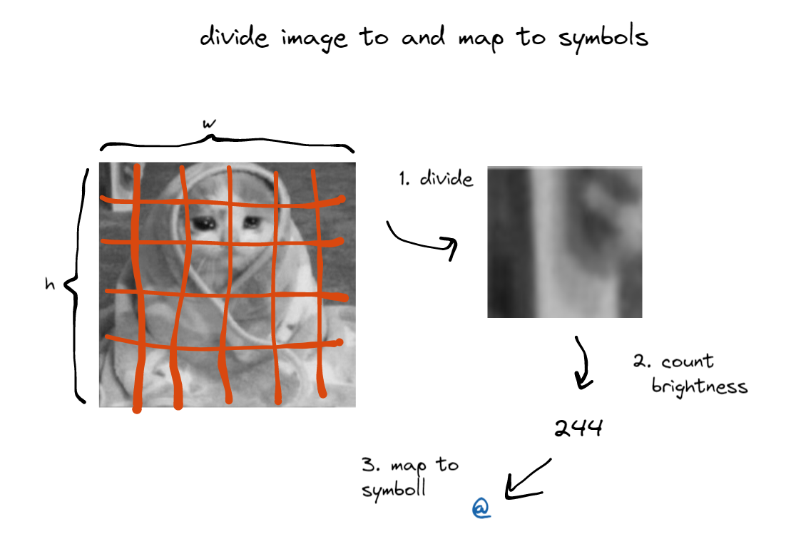

## TinyAScii - simple cli based C++ ascii generator 

____
> **Note**
>
> WIP - Work In Progress
----

The program converts images into ascii art.
 Supported image formats:

- PNG
- JPG
- GIF
- PIC
____
## Instructions

### Instalation 

 - git clone github.com/Robotozzz/tinyAscii
 - cmake
 - make

### Usage

Run with the `-i path_to_file` parameter

----
## how it works?

First we get the image, and pixel by pixel we go over it, 
using [BT.601](https://en.wikipedia.org/wiki/Rec._601) coefficients

Then we divide the image into small squares, for each of the squares we count its "brightness" 
and using this brightness we map it to a symbol from a special alphabet

`std::string asciiCharacters = " .:-=+*#%@";`

----

## Dependencies

- [stbi_image.h](https://github.com/nothings/stb)

